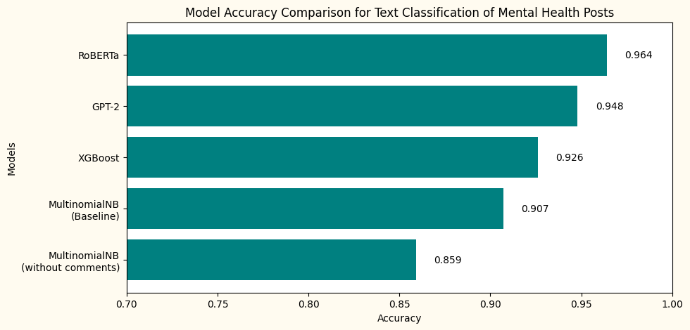

# :video_camera: Online Forum Survelliance using NLP :video_camera:
##### Classification of online forum posts to identify possible signs of mental distress in university students

# Table of Contents

1. [Background](#background)
2. [Purpose](#purpose)
3. [Methodology](#methodology)
4. [Data Dictionary](#data-dictionary)
5. [Models Used](#models-used)
6. [Summary of Findings](#summary-of-findings)
7. [Installation](#installation)
    - [Hardware](#hardware)
    - [Dependencies](#dependencies)
    - [File Format](#file-format)
8. [Annexes](#annexes)
    - [Datasets](#datasets)
    
## Background
In recent years, mental health disorders have become increasingly prevalent among younger people in Singapore, with a noticeable rise in diagnoses among students. The pressures of academic performance, social media influence, and the fast-paced lifestyle might be some of the contributing factors to this growing concern. Schools and universities are reporting higher instances of anxiety, depression, and stress-related disorders among their students. As awareness and understanding of mental health issues improve, more young people are seeking help and getting diagnosed, highlighting the urgent need for enhanced mental health support and resources in educational institutions and the broader community.

## Purpose
In this project, we will train a model to be able to tell apart mental health related online forum posts with non-mental health related ones. This model can be fine-tuned and kept up-to-date, and be deployed as bots in university online forums to detect and flag out posts which may show signs of possible mental distress. The school committee may then take the necessary early intervention steps and provide a support system to the affected individuals.

## Methodology
We first scraped the posts and comments from a popular online community forum Reddit, for both mental health and non-mental health types of posts. The subreddits chosen for this purpose are r/mentalhealth and r/casualconversation. These posts and comments were labelled for the supervised training of our models. A separate python script `praw_scraper.py` was written for the scraping of data from Reddit. The data collected were then cleaned and preprocessed using Natural Language Processing (NLP) techniques to be fed into our models. Several models were used with different parameters, and at the end we evaluated and compared the different models and gave a model recommendation and suggested future improvements for the project.

## Data Dictionary
Using the Python Reddit API Wrapper (PRAW), we scraped the posts and comments into two datasets, where one dataset contains all the mental health related posts and the other containing all non-mental health related posts, for easy labelling. They were saved as 'subreddit_casualconversation_20240614.csv' and 'subreddit_mentalhealth_20240614.csv'. Below is the data dictionary of the datasets mentioned:

| Feature  | Type | Description                                                                                                  |
|----------|------|--------------------------------------------------------------------------------------------------------------|
| id       | obj  | Unique ID identifying test reddit post                                                                       |
| title    | obj  | Title of reddit post                                                                                         |
| body     | obj  | Main text of reddit post                                                                                     |
| score    | int  | Total score of reddit post                                                                                   |
| num_comments | int  | Number of comments and replies of reddit post                                                                      |
| comments | obj  | Comments and replies of reddit post                                                                      |
| category   | obj  | Category of posts of the subreddit that the post was scraped from (New, Hot, Top, Rising) |

## Models Used
1. Multinomial Naive Bayes Model (Baseline)
2. XGBoost Classifier
3. RoBERTa
4. GPT-2

We explored several models, from using classic NLP techniques to preprocess the data and feeding them to Naive Bayes Model and XGBoost Classifier, to fine-tuning more advanced deep learning transformer models and LLMs like RoBERTa and GPT-2.

## Summary of Findings

From the chart below, we can see that the models show very different scores ranging from 0.86 to 0.96 when it comes to accuracy. As expected, RoBERTa and GPT-2 models outperform the rest of the models when it comes to NLP tasks. Being a highly sensitive topic, we would recommend the university to adopt the RoBERTa model for their use case, due to its high accuracy in detecting mental health related issues. However, the university needs to be aware that for the model to run seamlessly and efficiently, GPU accelerators should be used.

Albeit so, much more can be done to build a more accurate and robust model for the use case. Future improvements that can be considered include:

1. Getting more datapoints (Only about 2000 datapoints with a 50:50 class ratio was used)
2. Tuning the hyperparameters of the different models
3. Trying an ensemble of gradient boosted models together with XGBoost such as LightGBM
4. Trying out different combinations of models, stemmer, lemmatizer and vectorizers
5. Periodically updating and retraining the model with new datasets for the model to learn new and upcoming mental disorders

## Installation

##### *Hardware*

An Intel i5 computer with 16GB RAM and an NVIDIA RTX4070 Super GPU was used to train the deep learning models in this project (~10min to run the full notebook)

##### *Dependencies*

Install the dependencies by opening your terminal in the project folder and run:

`pip install -r requirements.txt`

After installation, you should then be able to run the code smoothly :smile:

##### *File Format*

The main project file is in .ipynb format and was created in VS Code and Jupyter Notebook :book:

### Annexes

##### *Datasets*

*'subreddit_casualconversation_20240614.csv'* - https://www.reddit.com/r/CasualConversation/ </n>
Posts scraped from subreddit r/CasualConversation

*'Subreddit_mentalhealth_20240614.csv'* - https://www.reddit.com/r/MentalHealth/ </n>
Posts scraped from subreddit r/MentalHealth
